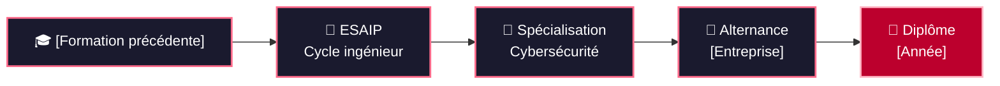

<a id="top"></a>

<!-- ===== BANNIÈRE (nuit · torii · sakura) ===== -->
<p align="center">
  
</p>

<!-- ===== TEXTE ANIMÉ ===== -->
<p align="center">
  
</p>

<!-- ===== CONTACTS ===== -->
<p align="center">
  <a href="https://linkedin.com/in/USER"></a>
  <a href="mailto:EMAIL"></a>
  <a href="https://tryhackme.com/p/USER"></a>
  <a href="https://USER.github.io"></a>
</p>

<!-- ===== NAVIGATION ===== -->
<p align="center">
  <a href="#apropos"></a>
  <a href="#parcours"></a>
  <a href="#stack"></a>
  <a href="#projets"></a>
  <a href="#activite"></a>
  
</p>

<!-- séparateur -->


<a id="apropos"></a>

## 🌸 À propos

<table>
<tr>
<td width="58%" valign="top">

- 🎓 Cycle ingénieur **cybersécurité** (Bac+5) — ESAIP
- 💼 Alternance : _[entreprise / poste]_
- 🔭 En cours : _[projet principal]_
- 🌱 J'apprends : _[pentest AD, cloud security, SOC…]_
- 🗾 Passionné par le **Japon** : _[culture, langue, voyages…]_
- 📍 Aix-en-Provence, France

</td>
<td width="42%" valign="top">

```yaml
mayron:
  role: "Cybersecurity Engineering Student"
  level: "Bac+5"
  location: "Aix-en-Provence"
  focus: ["Pentest", "Blue Team", "Automation"]
  passion: "Japon"
```

</td>
</tr>
</table>


<a id="parcours"></a>

## ⛩️ Parcours




<a id="stack"></a>

## 🛠️ Stack

<p align="center">
  
</p>

<details>
<summary><b>🔐 Outils sécurité — cliquer pour déplier</b></summary>
<br>

| Domaine | Outils |
|---|---|
| **Reconnaissance** | Nmap · _[…]_ |
| **Web** | Burp Suite · _[…]_ |
| **Exploitation** | Metasploit · _[…]_ |
| **Réseau / forensic** | Wireshark · _[…]_ |
| **Défense / SOC** | _[SIEM, EDR…]_ |

<p align="center">
  
  
  
  
</p>

</details>

<details>
<summary><b>📚 Compétences par niveau — cliquer pour déplier</b></summary>
<br>

| Compétence | Niveau |
|---|---|
| Python / scripting |  |
| Linux / administration |  |
| Pentest web |  |
| Active Directory |  |

<sub>Niveaux à ajuster honnêtement.</sub>

</details>


<a id="projets"></a>

## 🏯 Projets

<p align="center">
  <a href="https://github.com/USER/PROJET_1"></a>
  <a href="https://github.com/USER/PROJET_2"></a>
</p>

<details>
<summary><b>🔎 Détails des projets</b></summary>
<br>

**PROJET_1** — _Problème · solution · résultat chiffré._
`Python` `Docker`

**PROJET_2** — _Problème · solution · résultat chiffré._
`…`

</details>


<a id="activite"></a>

## 📊 Activité

<details>
<summary><b>📈 Statistiques détaillées</b></summary>
<br>

<p align="center">
  
  
</p>

</details>


<!-- ===== FIN : signature animée + contact ===== -->
<p align="center">
  
</p>

<p align="center">
  <a href="https://linkedin.com/in/USER"></a>
  <a href="#top"></a>
</p>
