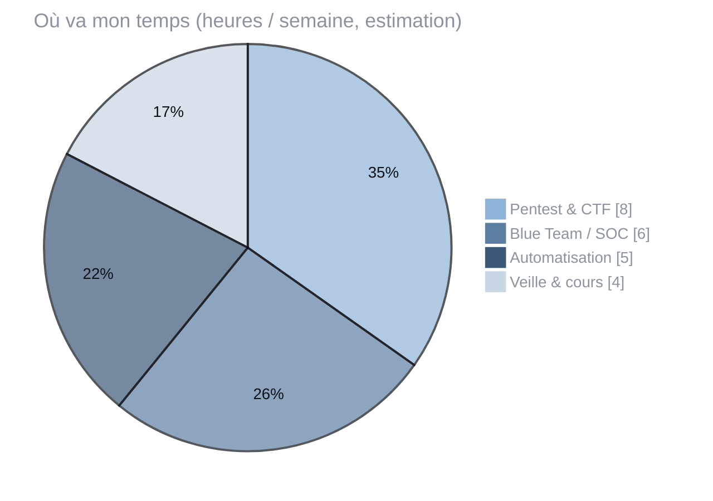

<picture>
  <source media="(prefers-color-scheme: dark)" srcset="https://readme-typing-svg.demolab.com?font=Inter&weight=800&size=64&duration=1500&pause=99999&color=E6EBF2&center=true&vCenter=true&width=420&height=90&repeat=false&lines=Mayron"/>
  
</picture>

  

  

[**LinkedIn**](https://linkedin.com/in/USER) &nbsp;·&nbsp; [**Email**](mailto:EMAIL) &nbsp;·&nbsp; [**TryHackMe**](https://tryhackme.com/p/USER)

  

### `01` &nbsp;À propos

Je me forme à la cybersécurité, côté attaque comme côté défense. 
J'aime comprendre comment un système fonctionne pour savoir le protéger, et automatiser tout ce qui peut l'être.

> [!NOTE]
> **En ce moment**
> - 💼 Alternance chez _[entreprise]_ — _[poste]_
> - 🔭 Projet en cours : _[nom du projet]_
> - 🌱 J'apprends : _[ex. Active Directory, détection SOC]_
> - 🗾 Hors clavier : passionné par le Japon

 

### `02` &nbsp;Expertise

| 🔓 &nbsp;Offensif | 🛡️ &nbsp;Défensif | ⚙️ &nbsp;Automatisation |
|:--|:--|:--|
| Pentest web | Analyse de logs | Scripts Python |
| Active Directory | Détection & réponse | Bash · PowerShell |
| Reconnaissance | Durcissement système | Outils internes |

 

### `03` &nbsp;Stack

 

### `04` &nbsp;Projets

**[PROJET_1](https://github.com/USER/PROJET_1)** &nbsp;`Python` `Docker` 
Problème résolu et résultat, en une phrase.

**[PROJET_2](https://github.com/USER/PROJET_2)** &nbsp;`Bash` 
Problème résolu et résultat, en une phrase.

 

### `05` &nbsp;Activité

  

 

⬡ &nbsp;protéger · comprendre · automatiser

