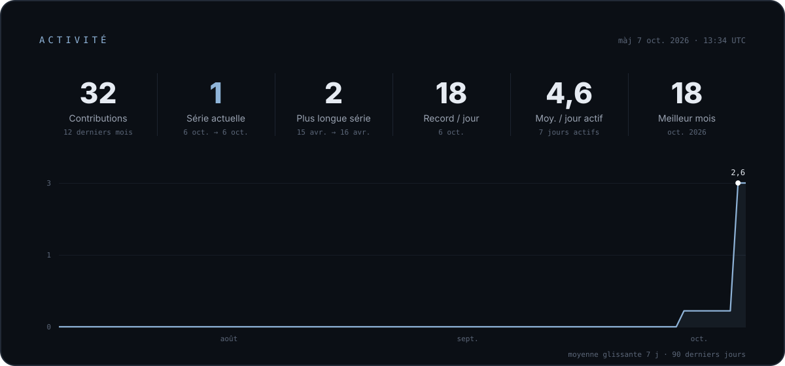
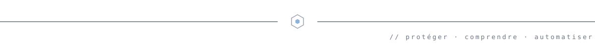

  

> **⬡ Pourquoi l'hexagone ?** Le _kikkō_, motif de carapace de tortue des blasons japonais, symbolise la protection et la longévité. Exactement ce qu'on attend d'un système bien sécurisé.

  <a href="https://www.linkedin.com/in/mayron-bejjaj/"><b>LinkedIn</b></a> &nbsp;·&nbsp;
  <a href="https://tryhackme.com/p/noshiubito"><b>TryHackMe</b></a>

 

### `01` &nbsp;En ce moment

> [!NOTE]
> - 💼 Alternance chez _[entreprise]_ — _[poste]_
> - 🔭 Projet en cours : _[nom du projet]_
> - 🌱 J'apprends : _[ex. Active Directory, détection SOC]_

 

### `02` &nbsp;Stack

<b>LANGAGES</b> 

<b>SYSTÈMES & OUTILS</b> 

<b>SÉCURITÉ</b> 

 

### `03` &nbsp;Projets

  
  

 

### `04` &nbsp;Activité

  

  

