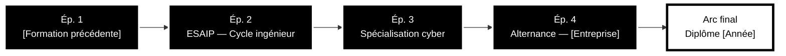

<!-- ===== TITRE (style manga, s'adapte au thème clair/sombre) ===== -->

  <picture>
    <source media="(prefers-color-scheme: dark)" srcset="https://readme-typing-svg.demolab.com?font=Bangers&size=72&duration=1800&pause=99999&color=FFFFFF&center=true&vCenter=true&width=500&height=100&repeat=false&lines=MAYRON"/>
    
  </picture>

<!-- ===== NARRATION ANIMÉE ===== -->

  

<!-- ===== CONTACTS ===== -->

  
  
  
  

<!-- ===== SOMMAIRE ===== -->

  
  
  
  
  
  

---

## 📖 Chapitre 1 — Fiche personnage

<table>
<tr>
<td width="55%" valign="top">

| | |
|---|---|
| **Nom** | Mayron |
| **Classe** | Ingénieur cybersécurité |
| **Niveau** | Bac+5 — ESAIP |
| **Guilde** | _[Entreprise d'alternance]_ |
| **Base** | Aix-en-Provence |
| **Spécialité** | Pentest · Blue Team · Automatisation |
| **Quête en cours** | _[Projet principal]_ |
| **Passion** | Japon · manga |

</td>
<td width="45%" valign="top">

**⚡ Stats du personnage**

| Stat | Niveau |
|---|---|
| Python |  |
| Linux |  |
| Pentest web |  |
| Active Directory |  |

Niveaux à ajuster honnêtement.

</td>
</tr>
</table>

> 💬 **Mayron :** « _[Ta phrase d'accroche / devise — ex. « Comprendre le système pour mieux le protéger. »]_ »

---

## 📖 Chapitre 2 — L'arc du parcours

---

## 📖 Chapitre 3 — Arsenal

  

<b>🗡️ Armes de sécurité — cliquer pour dégainer</b>

 

| Technique | Outils |
|---|---|
| **Reconnaissance** | Nmap · _[…]_ |
| **Attaque web** | Burp Suite · _[…]_ |
| **Exploitation** | Metasploit · _[…]_ |
| **Analyse réseau** | Wireshark · _[…]_ |
| **Défense / SOC** | _[SIEM, EDR…]_ |

  
  
  
  

---

## 📖 Chapitre 4 — Missions accomplies

  
  

<b>🔎 Rapport de mission</b>

 

**Mission 1 — PROJET_1** · _Problème · solution · résultat chiffré._
`Python` `Docker`

**Mission 2 — PROJET_2** · _Problème · solution · résultat chiffré._
`…`

---

## 📖 Chapitre 5 — Activité

<b>📈 Statistiques détaillées</b>

 

  
  

---

<!-- ===== FIN DE CHAPITRE ===== -->

  

  
  

