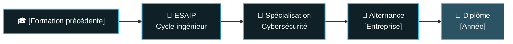

<a id="top"></a>

<!-- ===== BANNIÈRE ===== -->
<p align="center">
  
</p>

<!-- ===== TEXTE ANIMÉ ===== -->
<p align="center">
  
</p>

<!-- ===== CONTACTS (cliquables) ===== -->
<p align="center">
  <a href="https://linkedin.com/in/USER"></a>
  <a href="mailto:EMAIL"></a>
  <a href="https://tryhackme.com/p/USER"></a>
  <a href="https://USER.github.io"></a>
</p>

<!-- ===== MENU DE NAVIGATION ===== -->
<p align="center">
  <a href="#-à-propos">À propos</a> •
  <a href="#-parcours">Parcours</a> •
  <a href="#️-stack">Stack</a> •
  <a href="#-projets-phares">Projets</a> •
  <a href="#-certifications--ctf">Certifs</a> •
  <a href="#-activité">Activité</a>
</p>

<p align="center">
  
</p>

<br>

## 🧑‍💻 À propos

<table>
<tr>
<td width="60%" valign="top">

- 🎓 Cycle ingénieur **cybersécurité** (Bac+5) — ESAIP
- 💼 Alternance : _[entreprise / poste]_
- 🔭 En cours : _[projet principal]_
- 🌱 J'apprends : _[pentest AD, cloud security, SOC…]_
- 📍 Aix-en-Provence, France

</td>
<td width="40%" valign="top">

```yaml
mayron:
  role: "Cybersecurity Engineering Student"
  level: "Bac+5"
  location: "Aix-en-Provence"
  focus: ["Pentest", "Blue Team", "Automation"]
  status: "open to collaborate"
```

</td>
</tr>
</table>

<br>

## 🧭 Parcours



<br>

## 🛠️ Stack

<p align="center">
  
</p>

<details>
<summary><b>🔐 Outils sécurité — cliquer pour déplier</b></summary>
<br>

| Domaine | Outils |
|---|---|
| **Reconnaissance** | Nmap · _[…]_ |
| **Web** | Burp Suite · _[…]_ |
| **Exploitation** | Metasploit · _[…]_ |
| **Réseau / forensic** | Wireshark · _[…]_ |
| **Défense / SOC** | _[SIEM, EDR…]_ |

<p align="center">
  
  
  
  
</p>

</details>

<details>
<summary><b>📚 Compétences par niveau — cliquer pour déplier</b></summary>
<br>

| Compétence | Niveau |
|---|---|
| Python / scripting |  |
| Linux / administration |  |
| Pentest web |  |
| Active Directory |  |

<sub>Niveaux à ajuster honnêtement.</sub>

</details>

<br>

## 🚀 Projets phares

<p align="center">
  <a href="https://github.com/USER/PROJET_1"></a>
  <a href="https://github.com/USER/PROJET_2"></a>
</p>

<details>
<summary><b>🔎 Détails des projets</b></summary>
<br>

**PROJET_1** — _Problème · solution · résultat chiffré._
`Python` `Docker`

**PROJET_2** — _Problème · solution · résultat chiffré._
`…`

</details>

<br>

## 🏅 Certifications & CTF

<details open>
<summary><b>Voir la liste</b></summary>
<br>

| | |
|:--:|---|
| 📜 | _[Certif — ex. eJPT, Security+, TryHackMe SAL1]_ |
| 🚩 | _[CTF / classement — ex. Top X% TryHackMe, Root-Me N pts]_ |

</details>

<br>

## 📊 Activité

<!-- Serpent animé : nécessite le workflow snake.yml -->
<p align="center">
  <picture>
    <source media="(prefers-color-scheme: dark)" srcset="https://raw.githubusercontent.com/USER/USER/output/github-snake-dark.svg"/>
    
  </picture>
</p>

<details>
<summary><b>📈 Statistiques détaillées</b></summary>
<br>

<p align="center">
  
  
</p>

</details>

<p align="right"><a href="#top">⬆ Retour en haut</a></p>

<!-- ===== PIED DE PAGE ===== -->
<p align="center">
  
</p>
